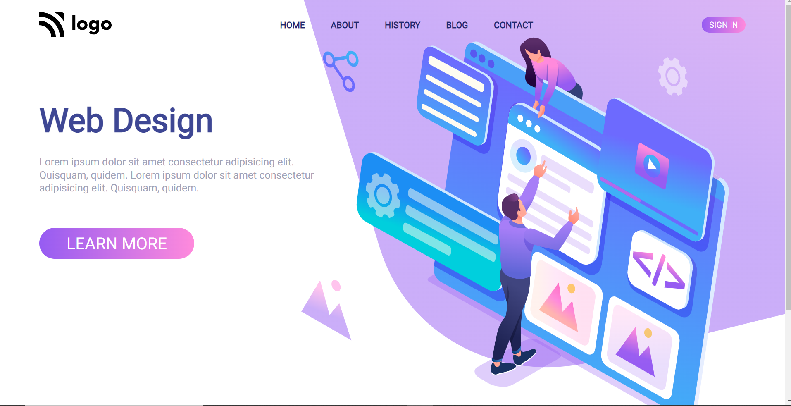

# Web-design-Landing-page

## About Project

This is a simple landing page of a web designing company or something. 

## Concepts Used

 - flex display property for navbar.
 - positioning for aligning that background curve behind that image.
 - linear gradiant property for color you see in buttons.
 - simple concepts like margin, padding etc.

## Time Taken

It took me around 5.5 hours and additional hour to make it rresponsive.

## Find Me on

 - [LinkedIn](https://www.linkedin.com/in/varun-g-65282489)
 - [Github](https://github.com/varung735)

> This website is responsive now. you can use your PC, Tablets or Phones to access this website.

## Thank You.